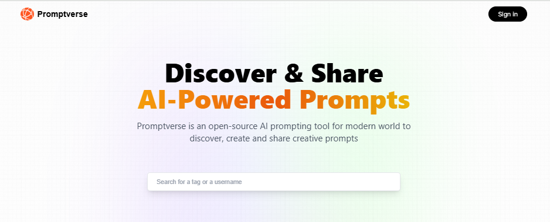

# 🚀 Promptverse

Promptverse is a **Next.js-based** web application that allows users to **create, share, and explore AI-generated prompts**. The application uses **NextAuth** for authentication, supporting **Google OAuth**.

---

## ✨ Features

- 🔑 **User Authentication**: Secure authentication using **Google OAuth** with **NextAuth**.
- ✍️ **Prompt Creation**: Users can create and manage their **AI-generated prompts**.
- 🏷️ **Tagging System**: Organize prompts with relevant tags.
- 👤 **User Profiles**: View other users' profiles and their respective prompts.
- ✏️ **Prompt Management**: Users can **edit** and **delete** only their own prompts.
- 🔍 **Search Functionality**: Search prompts by **username, tag, or prompt content**.
- 🎯 **Tag-Based Filtering**: Click on a tag to automatically filter prompts related to that tag.
- 🗄️ **Database Integration**: **MongoDB** for storing user-generated prompts.
- ⚡ **Next.js API Routes**: Backend powered by **Next.js API routes**.

---

## 🛠️ Tech Stack

- 🎨 **Frontend**: Next.js (**TypeScript**)
- 🖥️ **Backend**: Next.js API Routes
- 🔐 **Authentication**: NextAuth.js (**Google OAuth**)
- 🗃️ **Database**: MongoDB with Mongoose
- 💅 **Styling**: Tailwind CSS

---

## 📦 Installation

### ✅ Prerequisites

Ensure you have the following installed:

- ⚡ **Node.js** (v18+ recommended)
- 🛢️ **MongoDB** (Local or Cloud)
- 📦 **npm** (recommended)

### 🛠️ Steps

1️⃣ **Clone the repository:**

```bash
git clone https://github.com/gulshanb098/Promptverse.git
cd Promptverse
```

2️⃣ **Install dependencies:**

```bash
npm install
```

3️⃣ **Create a `.env.local` file** in the root directory and add the following environment variables:

```env
NEXTAUTH_SECRET=your_secret_key
NEXTAUTH_URL=http://localhost:3000
NEXTAUTH_URL_INTERNAL=http://localhost:3000
GOOGLE_CLIENT_ID=your_google_client_id
GOOGLE_CLIENT_SECRET=your_google_client_secret
MONGODB_URI=your_mongodb_connection_string
```

4️⃣ **Run the development server:**

```bash
npm run dev
```

🚀 The app will be available at `http://localhost:3000`

---

## 📡 API Routes

### 🔐 Authentication
- 📌 **GET** `/api/auth/[...nextauth]` - NextAuth authentication routes

### 📝 Prompts
- 📌 **POST** `/api/prompt/new` - Create a new prompt
- 📌 **GET** `/api/prompt` - Fetch all prompts
- 📌 **GET** `/api/prompt/[id]` - Fetch a specific prompt
- 📌 **DELETE** `/api/prompt/[id]` - Delete a prompt

### 👥 Users
- 📌 **GET** `/api/users/[id]` - Fetch a user profile
- 📌 **GET** `/api/users/[id]/posts` - Fetch all posts by a specific user

---

## 🤝 Contributing

💡 Feel free to submit **issues** or **pull requests** to improve the project!

---

## 📜 License

This project is licensed under the **MIT License**.

---



Made with ❤️ by **Gulshan**
